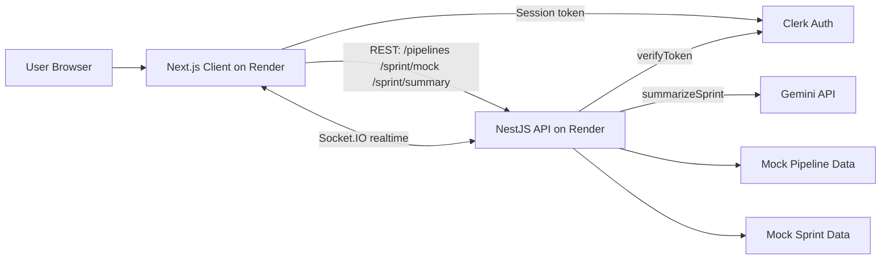

# OpsBoard

OpsBoard is a full-stack DevOps visibility dashboard that combines **live CI/CD pipeline activity** with **AI-generated sprint summaries** for faster engineering status reporting.

## Current Version

MVP v0.1.0 includes authentication, real-time pipeline updates, AI sprint summaries, Dockerized local development, and Render deployment.

## What This Demonstrates

- Full-stack TypeScript development
- Real-time WebSocket communication
- Authentication with Clerk
- AI API integration with Gemini
- Dockerized local development
- Cloud deployment on Render
- DevOps-style dashboard design

## Live Demo

- Frontend: `https://<your-opsboard-web>.onrender.com`
- Backend health check: `https://<your-opsboard-api>.onrender.com/health`

## Problem Statement

Engineering teams often track delivery status across multiple tools (CI, PRs, sprint boards, release notes). OpsBoard provides a single, readable dashboard for:

- real-time pipeline monitoring
- sprint status communication
- AI-assisted summary generation for leadership and standups

## Features

- Clerk authentication (frontend + protected backend endpoint)
- Live pipeline feed via Socket.IO (`pipeline:snapshot`, `pipeline:update`)
- Mock CI/CD run generator for MVP demos
- AI sprint summary generation using Gemini
- Responsive Next.js dashboard UI
- Dockerized local development and Render-ready deployment setup

## Tech Stack

- **Frontend:** Next.js (App Router), TypeScript, Tailwind CSS, TanStack Query, Clerk, Socket.IO Client
- **Backend:** NestJS, TypeScript, Socket.IO Gateway, Clerk token verification, Gemini API (`@google/genai`)
- **DevOps:** Docker, Docker Compose, Render
- **Package Management:** pnpm workspaces

## Architecture



## Local Setup

### Prerequisites

- Node.js 20+
- pnpm 10+
- Docker + Docker Compose

### Run with Docker (recommended)

```bash
pnpm dev
```

App URLs:

- Frontend: `http://localhost:3000`
- Backend: `http://localhost:4000`

### Run without Docker

```bash
pnpm install
pnpm --filter ./server start:dev
pnpm --filter ./client dev
```

## Environment Variables

### `server/.env`

- `PORT=4000`
- `CLIENT_URL=http://localhost:3000`
- `CLERK_SECRET_KEY=`
- `CLERK_AUTHORIZED_PARTIES=http://localhost:3000`
- `GEMINI_API_KEY=`
- `GEMINI_MODEL=gemini-3-flash-preview`

### `client/.env.local`

- `NEXT_PUBLIC_CLERK_PUBLISHABLE_KEY=`
- `NEXT_PUBLIC_API_URL=http://localhost:4000`
- `NEXT_PUBLIC_SOCKET_URL=http://localhost:4000`

## Docker Setup

- `server/Dockerfile` includes `dev` and `prod` targets (Node 20 Alpine + pnpm via corepack)
- `client/Dockerfile` includes `dev` and `prod` targets (Node 20 Alpine + pnpm via corepack)
- Root `docker-compose.yml` runs both services with bind mounts for local development

## Render Deployment Notes

- Deploy as two Docker Web Services:
  - `opsboard-api` (Root Directory: `server`)
  - `opsboard-web` (Root Directory: `client`)
- Set cross-service URLs:
  - backend `CLIENT_URL` = frontend Render URL
  - frontend `NEXT_PUBLIC_API_URL` = backend Render URL
  - frontend `NEXT_PUBLIC_SOCKET_URL` = backend Render URL
- Full deployment guide: `docs/deployment.md`

## API Endpoints

- `GET /` — basic server response
- `GET /pipelines` — returns pipeline runs (public)
- `GET /sprint/mock` — returns mock sprint data (public)
- `GET /sprint/summary` — returns AI sprint summary (protected by Clerk auth guard)
- `GET /health` — health endpoint for Render checks

## Socket.IO Events

- `pipeline:snapshot` — full initial pipeline list on connect
- `pipeline:update` — incremental new pipeline run every ~5 seconds

## AI Sprint Summary

When an authenticated user clicks **Generate Summary**:

1. Frontend requests a Clerk session token
2. Frontend calls `GET /sprint/summary` with `Authorization: Bearer <token>`
3. Backend validates token with Clerk
4. Backend sends mock sprint payload to Gemini
5. Backend returns a concise summary with timestamp

## Screenshots

Add project visuals here:

- `docs/screenshots/dashboard-overview.png`
- `docs/screenshots/live-pipelines.png`
- `docs/screenshots/ai-summary.png`

## Future Improvements

- Replace mock pipeline source with real CI providers (GitHub Actions / GitLab CI)
- Add historical trend charts and incident overlays
- Add organization/role-aware access control
- Add test coverage for auth, gateway, and AI service flows
- Add persistent storage for pipeline and sprint history

## Resume Bullets

- Built a full-stack DevOps dashboard (Next.js + NestJS) with real-time Socket.IO pipeline updates and Clerk-secured APIs.
- Implemented AI-powered sprint summarization using Gemini, reducing manual status reporting effort.
- Containerized frontend/backend with Docker and prepared multi-service production deployment on Render.
