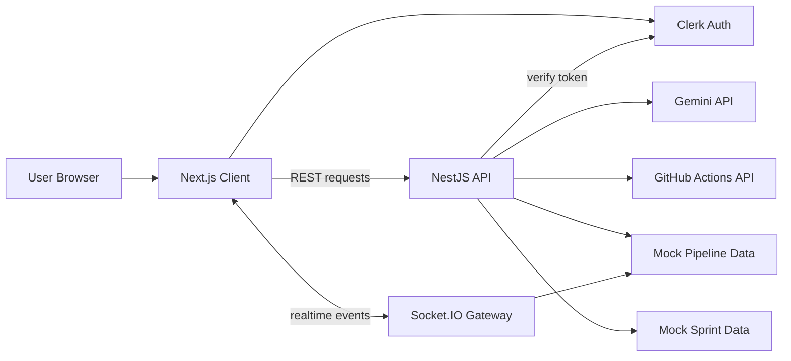
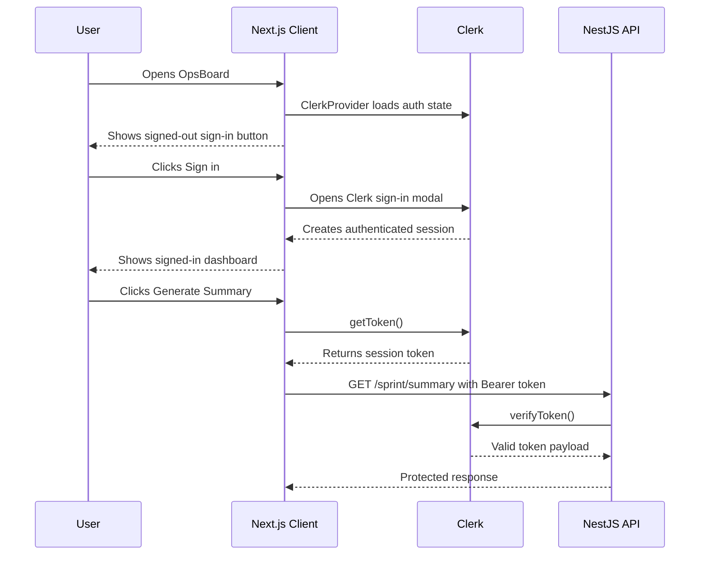
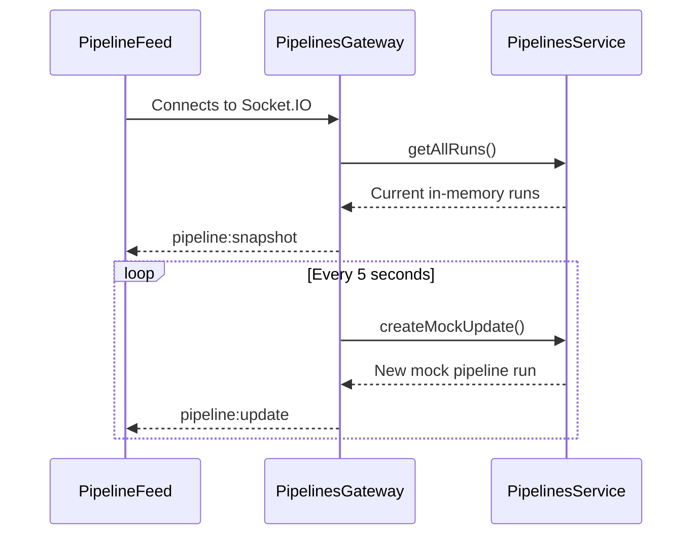
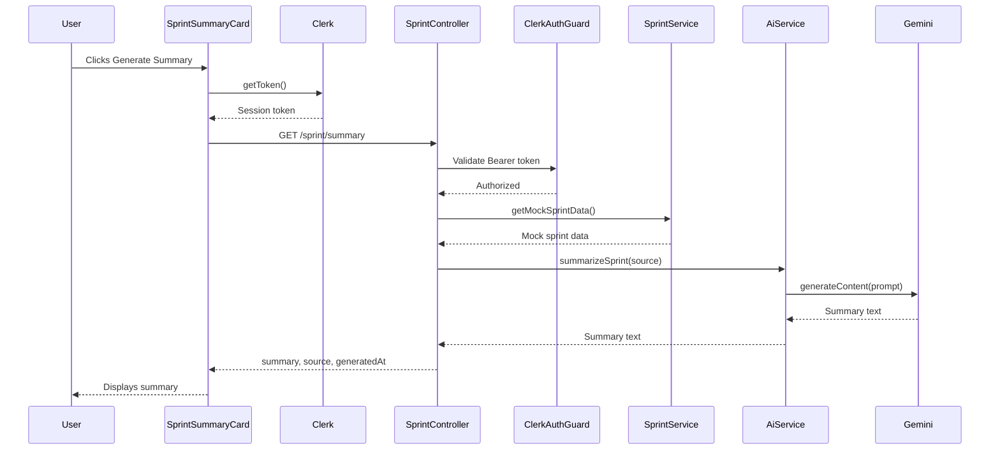
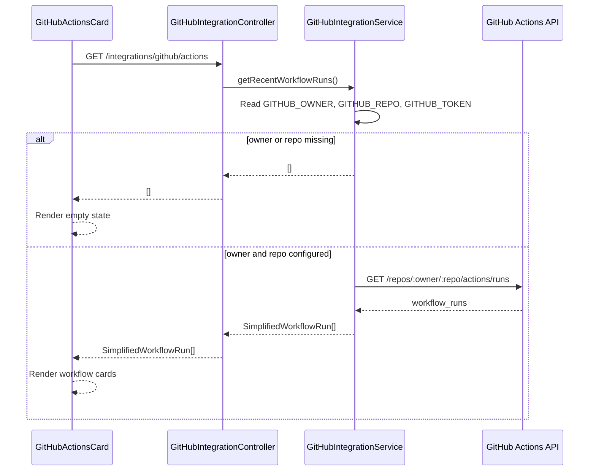

# OpsBoard Codebase Walkthrough

This document explains how the OpsBoard MVP is wired together so you can understand it, debug it, and explain it in an interview.

OpsBoard is a full-stack DevOps dashboard with:

- A Next.js frontend in `client/`
- A NestJS backend in `server/`
- Clerk authentication
- Socket.IO realtime pipeline updates
- Gemini-powered AI sprint summaries
- Optional GitHub Actions workflow run integration
- Docker Compose for local development
- Render deployment documentation

## 1. High-Level Architecture

OpsBoard gives a signed-in user a single dashboard for monitoring CI/CD activity and generating a sprint summary.

At MVP stage, most product data is intentionally simple:

- Pipeline runs are mock in-memory records generated by the backend.
- Sprint data is hardcoded mock data in the backend.
- GitHub Actions integration is real, but optional and environment-variable driven.
- Gemini is called server-side only, so API keys are never exposed to the browser.



## 2. Repository Structure

The repository is a pnpm monorepo.

Important root files:

- `package.json` defines root scripts like `pnpm dev`, `pnpm build`, and `pnpm lint`.
- `pnpm-workspace.yaml` registers `client` and `server` as workspace packages.
- `docker-compose.yml` runs the frontend and backend together for local development.
- `README.md` explains project setup, architecture, endpoints, and deployment.
- `docs/deployment.md` explains Render deployment.
- `docs/case-study.md` explains the project as a portfolio case study.

Frontend:

- `client/` contains the Next.js app.
- `client/src/app/` contains App Router files.
- `client/src/features/` contains dashboard feature components.
- `client/src/lib/` contains shared frontend helpers.
- `client/src/types/` contains frontend TypeScript types.
- `client/Dockerfile` defines dev and production Docker targets for the frontend.

Backend:

- `server/` contains the NestJS app.
- `server/src/main.ts` bootstraps the backend.
- `server/src/app.module.ts` wires all backend modules together.
- `server/src/auth/` contains Clerk token verification.
- `server/src/pipelines/` contains pipeline REST and Socket.IO logic.
- `server/src/sprint/` contains sprint mock data and summary endpoint.
- `server/src/ai/` contains Gemini integration.
- `server/src/integrations/github/` contains optional GitHub Actions integration.
- `server/Dockerfile` defines dev and production Docker targets for the backend.
- `server/.env.example` documents backend environment variables.

This structure works well for the MVP because frontend and backend are versioned together, but each app keeps its own dependencies, Dockerfile, and runtime.

## 3. Frontend Walkthrough

The frontend is a Next.js App Router app.

### App Shell

Main file:

- `client/src/app/layout.tsx`

Responsibilities:

- Wraps the app in `ClerkProvider`.
- Wraps the app in `QueryProvider`.
- Renders the shared header.
- Shows a Clerk sign-in button when signed out.
- Shows the Clerk `UserButton` when signed in.
- Loads global CSS and fonts.

The important idea is that authentication context and TanStack Query context are available to the entire frontend.

### Dashboard Page

Main file:

- `client/src/app/page.tsx`

Responsibilities:

- Shows a signed-out landing card.
- Shows the dashboard only when signed in.
- Renders the main dashboard sections:
  - Static metric cards
  - `PipelineFeed`
  - `SprintSummaryCard`
  - `GitHubActionsCard`

The page uses Clerk `Show` components to branch between signed-out and signed-in UI.

### Clerk Middleware

Main file:

- `client/src/proxy.ts`

Responsibilities:

- Runs Clerk middleware for frontend routes.
- Excludes static assets from the matcher.

This project uses `proxy.ts` rather than `middleware.ts`.

### TanStack Query Setup

Main file:

- `client/src/lib/query-provider.tsx`

Responsibilities:

- Creates a `QueryClient`.
- Provides it through `QueryClientProvider`.
- Sets default query behavior:
  - `staleTime: 15_000`
  - `refetchOnWindowFocus: false`

This file is a client component because TanStack Query manages browser-side state.

### API Helper

Main file:

- `client/src/lib/api.ts`

Responsibilities:

- Reads `NEXT_PUBLIC_API_URL`.
- Falls back to `http://localhost:4000`.
- Builds backend request URLs.
- Adds JSON headers.
- Adds `Authorization: Bearer <token>` when a token is provided.
- Throws readable errors for non-OK responses.

This helper keeps API calls consistent across frontend components.

### Socket Helper

Main file:

- `client/src/lib/socket.ts`

Responsibilities:

- Reads `NEXT_PUBLIC_SOCKET_URL`.
- Falls back to `http://localhost:4000`.
- Creates a Socket.IO client.
- Uses WebSocket transport.
- Disables auto-connect so components can decide when to connect.

### Pipeline Feed Component

Main file:

- `client/src/features/pipelines/pipeline-feed.tsx`

Responsibilities:

- Connects to the backend Socket.IO gateway.
- Tracks connection state.
- Handles connection errors.
- Listens for:
  - `pipeline:snapshot`
  - `pipeline:update`
- Keeps the newest 8 pipeline runs in local component state.

This is a client component because it uses React state, effects, and a browser WebSocket connection.

### AI Sprint Summary Component

Main file:

- `client/src/features/sprint-summary/sprint-summary-card.tsx`

Responsibilities:

- Uses Clerk `useAuth()` to get the current session token.
- Uses TanStack Query `useMutation()` for the Generate Summary action.
- Calls `GET /sprint/summary`.
- Displays loading, success, and error states.

This is a client component because it depends on user interaction, Clerk browser session state, and mutation state.

### GitHub Actions Card

Main file:

- `client/src/features/integrations/github-actions-card.tsx`

Responsibilities:

- Uses TanStack Query `useQuery()`.
- Calls `GET /integrations/github/actions`.
- Renders workflow name, branch, short commit SHA, status, updated time, and link to GitHub.
- Shows an empty state if no workflow runs are available.
- Shows an error state if the backend GitHub request fails.

### Frontend Environment Variables

Documented in:

- `client/.env.local.example`

Variables:

- `NEXT_PUBLIC_CLERK_PUBLISHABLE_KEY`
- `NEXT_PUBLIC_API_URL`
- `NEXT_PUBLIC_SOCKET_URL`

Only variables prefixed with `NEXT_PUBLIC_` are available in browser code.

## 4. Backend Walkthrough

The backend is a NestJS app organized by feature modules.

### Bootstrap Flow

Main file:

- `server/src/main.ts`

Responsibilities:

- Creates the Nest app from `AppModule`.
- Reads `CLIENT_URL`, defaulting to `http://localhost:3000`.
- Reads `PORT`, defaulting to `4000`.
- Enables CORS for the frontend origin.
- Enables global validation with `ValidationPipe`.
- Starts the HTTP server.

### App Module

Main file:

- `server/src/app.module.ts`

Responsibilities:

- Loads environment variables with `ConfigModule.forRoot({ isGlobal: true })`.
- Registers feature modules:
  - `AiModule`
  - `AuthModule`
  - `GitHubIntegrationModule`
  - `PipelinesModule`
  - `SprintModule`

### Health Endpoint

Main file:

- `server/src/app.controller.ts`

Endpoints:

- `GET /`
- `GET /health`

There is no separate health module. The health check is implemented directly in `AppController`.

`GET /health` returns:

```json
{
  "status": "ok",
  "timestamp": "..."
}
```

Render can use this endpoint as the backend health check.

### Auth Module

Main files:

- `server/src/auth/auth.module.ts`
- `server/src/auth/clerk-auth.guard.ts`

Responsibilities:

- Provides `ClerkAuthGuard`.
- Extracts the `Authorization` header.
- Requires the `Bearer <token>` format.
- Reads `CLERK_SECRET_KEY`.
- Reads `CLERK_AUTHORIZED_PARTIES`, or falls back to `CLIENT_URL`.
- Verifies the token with Clerk `verifyToken`.
- Adds the verified payload to `request.user`.

If verification fails, the guard returns `401 Unauthorized`.

### Pipelines Module

Main files:

- `server/src/pipelines/pipelines.module.ts`
- `server/src/pipelines/pipelines.controller.ts`
- `server/src/pipelines/pipelines.service.ts`
- `server/src/pipelines/pipelines.gateway.ts`
- `server/src/pipelines/pipeline-run.type.ts`

Responsibilities:

- `PipelinesController` exposes `GET /pipelines`.
- `PipelinesService` owns the in-memory mock pipeline runs.
- `PipelinesGateway` handles Socket.IO connections and broadcasts updates.
- `pipeline-run.type.ts` defines the backend pipeline run shape.

The service starts with two mock runs and generates new random runs through `createMockUpdate()`.

### Sprint Module

Main files:

- `server/src/sprint/sprint.module.ts`
- `server/src/sprint/sprint.controller.ts`
- `server/src/sprint/sprint.service.ts`

Endpoints:

- `GET /sprint/mock`
- `GET /sprint/summary`

Responsibilities:

- `SprintService` returns hardcoded mock sprint data.
- `SprintController` exposes the sprint endpoints.
- `/sprint/mock` is public.
- `/sprint/summary` is protected by `ClerkAuthGuard`.
- `/sprint/summary` sends mock sprint data to `AiService`.

### AI / Gemini Module

Main files:

- `server/src/ai/ai.module.ts`
- `server/src/ai/ai.service.ts`

Responsibilities:

- Reads `GEMINI_API_KEY`.
- Reads `GEMINI_MODEL`, defaulting to `gemini-3-flash-preview`.
- Builds a structured sprint-summary prompt.
- Calls Gemini with `@google/genai`.
- Returns the generated text.

Failure behavior:

- Missing `GEMINI_API_KEY`: throws a server error.
- Gemini request failure: throws a bad gateway error.
- Empty Gemini response: throws a service unavailable error.

### GitHub Integration Module

Main files:

- `server/src/integrations/github/github-integration.module.ts`
- `server/src/integrations/github/github-integration.controller.ts`
- `server/src/integrations/github/github-integration.service.ts`
- `server/src/integrations/github/github-integration.types.ts`

Endpoint:

- `GET /integrations/github/actions`

Responsibilities:

- Reads `GITHUB_OWNER`.
- Reads `GITHUB_REPO`.
- Reads optional `GITHUB_TOKEN`.
- Calls GitHub Actions workflow runs API.
- Transforms GitHub's response into a smaller frontend-friendly shape.

If `GITHUB_OWNER` or `GITHUB_REPO` is missing, the service returns an empty array.

### Backend Environment Variables

Documented in:

- `server/.env.example`

Variables:

- `PORT`
- `CLIENT_URL`
- `CLERK_SECRET_KEY`
- `CLERK_AUTHORIZED_PARTIES`
- `GEMINI_API_KEY`
- `GEMINI_MODEL`
- `GITHUB_OWNER`
- `GITHUB_REPO`
- `GITHUB_TOKEN`

## 5. Key Request Flows

### Sign In Flow



Important files:

- `client/src/app/layout.tsx`
- `client/src/app/page.tsx`
- `client/src/features/sprint-summary/sprint-summary-card.tsx`
- `client/src/lib/api.ts`
- `server/src/auth/clerk-auth.guard.ts`
- `server/src/sprint/sprint.controller.ts`

### Live Pipeline Updates Flow



Important files:

- `client/src/features/pipelines/pipeline-feed.tsx`
- `client/src/lib/socket.ts`
- `server/src/pipelines/pipelines.gateway.ts`
- `server/src/pipelines/pipelines.service.ts`

Event meanings:

- `pipeline:snapshot` is the full current list sent when a client connects.
- `pipeline:update` is one new mock run broadcast every 5 seconds.

### AI Sprint Summary Flow



Important files:

- `client/src/features/sprint-summary/sprint-summary-card.tsx`
- `client/src/lib/api.ts`
- `server/src/sprint/sprint.controller.ts`
- `server/src/sprint/sprint.service.ts`
- `server/src/auth/clerk-auth.guard.ts`
- `server/src/ai/ai.service.ts`

### GitHub Workflow Runs Flow



Important files:

- `client/src/features/integrations/github-actions-card.tsx`
- `server/src/integrations/github/github-integration.controller.ts`
- `server/src/integrations/github/github-integration.service.ts`
- `server/src/integrations/github/github-integration.types.ts`

## 6. API Endpoints

Public endpoints:

- `GET /`
- `GET /health`
- `GET /pipelines`
- `GET /sprint/mock`
- `GET /integrations/github/actions`

Protected endpoints:

- `GET /sprint/summary`

Socket.IO events:

- `pipeline:snapshot`
- `pipeline:update`

## 7. Docker And Local Development

Run the full app from the repository root:

```bash
pnpm dev
```

This runs:

- Backend on `http://localhost:4000`
- Frontend on `http://localhost:3000`

`docker-compose.yml` uses:

- `server/.env` for backend environment variables.
- `client/.env.local` for frontend environment variables.
- Bind mounts so local source changes are reflected in containers.
- Anonymous `node_modules` volumes so container dependencies do not get overwritten by the host.

Frontend Dockerfile targets:

- `dev`: runs `pnpm dev`
- `build`: runs `pnpm build`
- `prod`: runs `pnpm start`

Backend Dockerfile targets:

- `dev`: runs `pnpm start:dev`
- `build`: runs `pnpm build`
- `prod`: runs `node dist/main.js`

Common local issues:

- If the frontend cannot call the backend, check `NEXT_PUBLIC_API_URL`.
- If Socket.IO fails, check `NEXT_PUBLIC_SOCKET_URL`.
- If CORS fails, check backend `CLIENT_URL`.
- If summary generation fails, check `CLERK_SECRET_KEY`, `CLERK_AUTHORIZED_PARTIES`, and `GEMINI_API_KEY`.
- If Docker does not pick up dependency changes, rebuild with `docker compose up --build`.

## 8. Files To Read First

Recommended order:

1. `README.md`
2. `package.json`
3. `pnpm-workspace.yaml`
4. `docker-compose.yml`
5. `client/src/app/layout.tsx`
6. `client/src/app/page.tsx`
7. `client/src/proxy.ts`
8. `client/src/lib/query-provider.tsx`
9. `client/src/lib/api.ts`
10. `client/src/lib/socket.ts`
11. `client/src/features/pipelines/pipeline-feed.tsx`
12. `client/src/features/sprint-summary/sprint-summary-card.tsx`
13. `client/src/features/integrations/github-actions-card.tsx`
14. `server/src/main.ts`
15. `server/src/app.module.ts`
16. `server/src/auth/clerk-auth.guard.ts`
17. `server/src/pipelines/pipelines.service.ts`
18. `server/src/pipelines/pipelines.gateway.ts`
19. `server/src/sprint/sprint.controller.ts`
20. `server/src/sprint/sprint.service.ts`
21. `server/src/ai/ai.service.ts`
22. `server/src/integrations/github/github-integration.service.ts`
23. `docs/deployment.md`
24. `docs/case-study.md`

## 9. Interview Explanation

### 30-Second Version

OpsBoard is a full-stack DevOps monitoring dashboard built with Next.js and NestJS. It uses Clerk for authentication, Socket.IO for live pipeline updates, and Gemini on the backend to generate sprint summaries. The app is Dockerized for local development and documented for Render deployment as separate frontend and backend services.

### 2-Minute Version

OpsBoard solves fragmented engineering status reporting by putting pipeline activity and sprint summaries into one dashboard. The frontend is a Next.js App Router app using Clerk for sign-in, TanStack Query for API state, and Socket.IO Client for realtime updates. The backend is a NestJS app organized into modules for auth, pipelines, sprint data, AI, and GitHub integration.

When a user signs in, Clerk manages the session on the frontend. For protected backend calls, the frontend gets a Clerk token and sends it as a Bearer token. NestJS verifies that token with Clerk. Pipeline updates come from a Socket.IO gateway that sends an initial snapshot and then emits a new mock pipeline run every 5 seconds. AI summaries are generated by sending mock sprint data from the backend to Gemini, keeping the API key server-side.

### Technical Deep Dive

The monorepo has a `client` workspace and a `server` workspace. The client `layout.tsx` provides Clerk and TanStack Query context. The main dashboard in `page.tsx` renders different UI based on Clerk auth state. `PipelineFeed` owns the live Socket.IO connection, while `SprintSummaryCard` owns the Generate Summary mutation. API requests are centralized through `apiFetch`, which handles backend URLs, JSON headers, and optional Bearer tokens.

The server starts in `main.ts`, where CORS and validation are configured. `AppModule` imports all feature modules. `PipelinesGateway` pushes realtime events using data from `PipelinesService`. `SprintController` exposes public mock data and a protected summary endpoint. `ClerkAuthGuard` verifies session tokens with Clerk. `AiService` reads Gemini configuration, creates a structured prompt, calls Gemini, and returns the generated text. The optional GitHub integration reads repo configuration from env vars and maps GitHub Actions API responses into a smaller DTO for the frontend.

## 10. Future Improvements

The current MVP is intentionally simple. The most important limitations are:

- Pipeline data is mock and in-memory.
- Sprint data is hardcoded.
- Static metric cards are not calculated from real pipeline history.
- Socket.IO connections are not authenticated.
- Only `/sprint/summary` is protected on the backend.
- There is no database.
- There is limited automated test coverage.
- There is no rate limiting for AI summary generation.
- There is no observability layer for logs, metrics, or traces.

Recommended improvements:

- Replace mock pipeline updates with real GitHub Actions webhooks.
- Add persistent storage for pipeline runs and generated summaries.
- Calculate dashboard metrics from real pipeline data.
- Authenticate Socket.IO connections with Clerk tokens.
- Protect dashboard API endpoints consistently.
- Add tests for `ClerkAuthGuard`, `PipelinesGateway`, `AiService`, and GitHub integration.
- Add AI request rate limiting and better retry handling.
- Add organization/team-level authorization.
- Add DORA-style metrics such as deployment frequency, lead time, failure rate, and MTTR.
- Add structured logs and production monitoring.

